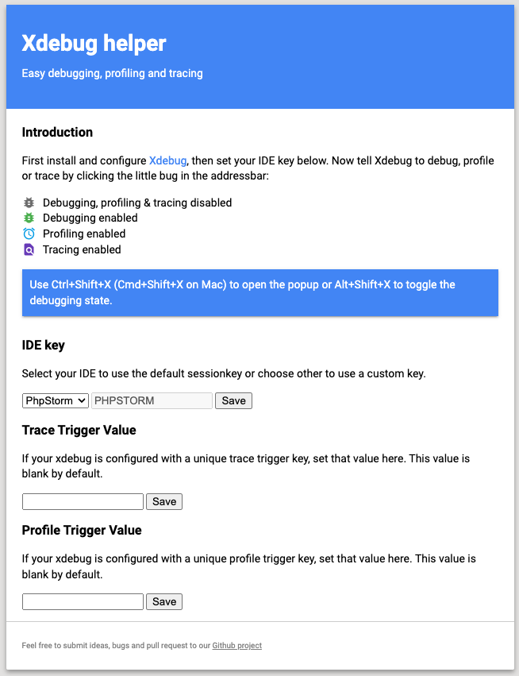

# Docker container for Jetbrains Gateway
Comme beaucoup de développeurs Symfony, je suis souvent confronté à des lenteurs avec Docker sur mon Mac. Ces lenteurs sont liées au partage des fichiers du projet entre l'host et les containers. Pour palier à ce problème, j'utilise soit docker-sync soit un partage NFS. Ces deux solutions fonctionnnent plutôt bien car les fichiers ne sont plus partagés directement par Docker. Loin d'être parfait, j'ai décidé de chercher une nouvelle alternative. Et si on ne partageait plus les fichiers ? Et si on travaillait directement dans le container ? JetBrains propose Gateway pour le developpement distant. Pour le moment encore en Beta, cette solution mérite quand même d'être essayée avec un container docker. Ce projet contient deux containers. Le premier permet à Gateway d'installer son serveur et l'autre contient Apache/PHP/XDebug/Symfony-cli. Les deux containers partagent les fichiers du projet. 
## Liste des containers
### dev-container
Ce container vous permettra de connecter Jetbrains Gateway et de lancer sur votre machine le client PHPStorm
### web
Ce container contient Apache/MySQL/Symfony-cli. Symfony 6.1 est installé au 1er lancement.
## Configuration
Faites une copie de .env.dist en .env et modifier le fichier avec vos données. 
## Démarrez le projet
Dans votre terminal, à la racine du projet, lancez la commande :

    docker-compose build && docker-compose up
    
## Connectez JetBrains Gateway
Lancez JetBrains Gateway depuis JetBrains ToolBox. 

Sélectionnez SSH Connection > New Connection.  

Pour vous connecter au conteneur, vous devez utiliser la configuration suivante :

    
Cliquez sur "Check Connection and Continue". Si tout se passe bien, Gateway va se connecter dans votre container et vous proposer d'installer un environnement de développement. Ici Nous allons sélectionner PHPStorm comme IDE. La "Project directory" est "/var/www/***PROJECT_NAME*** ". Si votre projet s'appelle demo, la project directory sera "/var/www/demo". 

Vous êtes prêt, cliquez sur Start IDE and Connect. Gateway va installer PHPStorm dans le container et lancer le client en local sur votre machine. 

## Web
Allez sur la page suivante avec votre navigateur préféré : 

    http://localhost

## XDebug
Je vous conseille d'utiliser xdebug helper. J'ai configuré xdebug en mode trigger avec PHPSTORM comme IDE key. 

Voici la configuration pour xdebug helper :

Vous n'avez plus qu'à activer/désactiver xdebug depuis l'icone dans le navigateur.

------------

Pour conclure, pour le moment, le test est positif mais je n'ai pas encore pu tester sur un gros projet SF. N'hésitez pas à m'envoyer vos commentaires par linkedin (https://www.linkedin.com/in/timoner/). 

